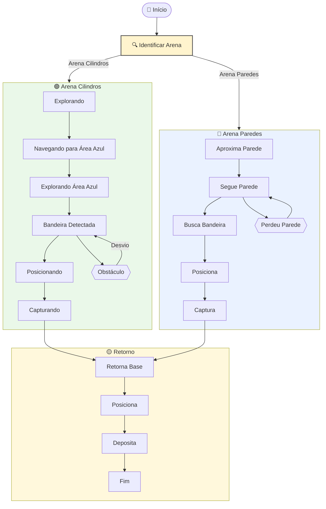

# Pegador de Bandeiras — ROS 2 (Trabalho 2)

**SSC0712 - Programação de Robôs Móveis - ICMC/USP**

Sistema Completo de Captura da Bandeira (ROS 2) — Prof. Dr. Matheus Machado dos Santos

Projeto de robô autônomo simulado em Gazebo que navega por uma arena, localiza uma bandeira azul via visão computacional (câmera semântica), realiza a captura com um manipulador (garra), e retorna à base para depositá-la dentro da área demarcada.

Este README documenta a versão **em grupo** do projeto (`controle_robo.py`), continuação do Trabalho 1.

## Autores

- Andre Luiz de Souza Murakami - nUSP 5631500 - [@Andre-Murakami](https://github.com/Andre-Murakami)
- Caio Cesar Trentin de Assis - nUSP 15674233 - [@CaioCesarTA](https://github.com/CaioCesarTA)
- João Pedro Lopes de Melo - nUSP 15588950 - [@jp-lopes](https://github.com/jp-lopes)

---

## 📑 Sumário

- [Autores](#autores)
- [Execução Local (ROS 2 Humble)](#-execução-local-ros-2-humble)
- [Diagrama da Máquina de Estados](#-diagrama-da-máquina-de-estados)
- [Estrutura do Projeto](#-estrutura-do-projeto)
- [Visão Geral do Controlador (`controle_robo.py`)](#-visão-geral-do-controlador-controle_robopy)
- [Sobre este Repositório](#-sobre-este-repositório)
- [Critérios de Avaliação](#critérios-de-avaliação-referência-do-enunciado)
- [Dúvidas](#dúvidas)

---

## 🚀 Execução Local (ROS 2 Humble)

### Pré-requisitos

Antes de executar o projeto, é necessário ter instalado:

- Ubuntu 22.04;
- ROS 2 Humble;
- Gazebo;
- Colcon;
- Git.

> **Observação:** Se esta for a primeira vez que você utiliza o ROS 2 nesta máquina, inicialize o `rosdep` apenas uma vez:
> ```bash
> sudo rosdep init
> rosdep update
> ```

### 1. Criar um workspace do ROS 2

```bash
mkdir -p ~/ros2_ws/src
cd ~/ros2_ws/src
```

### 2. Clonar o repositório

```bash
git clone -b pegador_de_bandeiras_final https://github.com/Andre-Murakami/pegador_de_bandeiras_mk1.git
```

### 3. Instalar as dependências do projeto

> Execute este passo apenas se esta for a primeira vez que o projeto é utilizado na máquina ou caso alguma dependência ainda não esteja instalada.

```bash
cd ~/ros2_ws
rosdep install --from-paths src --ignore-src -r -y
```

### 4. Compilar o workspace

```bash
cd ~/ros2_ws
colcon build
```

### 5. Carregar o ambiente do ROS 2

Em todo novo terminal utilizado para executar o projeto, carregue o ambiente do workspace:

```bash
cd ~/ros2_ws
source install/setup.bash
```

### 6. Executar a simulação

Abra **três terminais**.

#### Terminal 1 — Iniciar o Gazebo

```bash
cd ~/ros2_ws
source install/setup.bash
ros2 launch pegador_de_bandeiras_mk1 inicia_simulacao.launch.py
```

> **Cenários disponíveis**
>
> Os 3 cenários disponíveis são:
>
> - `arena_cilindros.sdf` (padrão)
> - `empty_arena.sdf`
> - `arena_paredes.sdf`
>
> Para escolher um cenário diferente do padrão, informe o parâmetro `world` ao executar o launch:
> ```bash
> ros2 launch pegador_de_bandeiras_mk1 inicia_simulacao.launch.py world:=empty_arena.sdf
> ```
> ou
> ```bash
> ros2 launch pegador_de_bandeiras_mk1 inicia_simulacao.launch.py world:=arena_paredes.sdf
> ```
> Se o parâmetro `world` não for informado, o cenário `arena_cilindros.sdf` (padrão) é iniciado.


#### Terminal 2 — Inserir o robô na simulação

```bash
cd ~/ros2_ws
source install/setup.bash
ros2 launch pegador_de_bandeiras_mk1 carrega_robo.launch.py
```

#### Terminal 3 — Executar o controlador do robô (versão em grupo)

```bash
cd ~/ros2_ws
source install/setup.bash
ros2 run pegador_de_bandeiras_mk1 controle_robo
```


---
 
## 🗺️ Diagrama da Máquina de Estados




---

## 📂 Estrutura do Projeto

```
pegador_de_bandeiras_mk1/
├── config/
├── description/
├── docker/
├── launch/
├── models/
├── pegador_de_bandeiras_mk1/       # Código-fonte Python do pacote
│   ├── controle_robo.py            # Controlador principal (versão em grupo)
│   ├── debug_cor_camera.py         # Script de depuração da câmera semântica
│   ├── ground_truth_odometry.py
│   ├── robo_mapper.py
│   └── __init__.py
├── resource/
├── rviz/
├── setup.py
├── setup.cfg
├── package.xml
├── test/
├── world/                          # Cenários (.sdf / .sdf.xacro) da arena
├── Diagrama_de_estados.png         # Diagrama da máquina de estados
└── README.md
```


## 🧠 Visão Geral do Controlador (`controle_robo.py`)

O robô é controlado por uma **máquina de estados finitos** implementada em Python (nó ROS 2 `controle_robo`), que evolui desde a exploração da arena até a captura da bandeira, retorno e depósito na base.

### Tópicos utilizados

| Tópico | Tipo | Uso |
|---|---|---|
| `/cmd_vel` | `geometry_msgs/Twist` | Comando de velocidade do robô |
| `/gripper_controller/commands` | `std_msgs/Float64MultiArray` | Controle da garra (elevação + abertura dos dedos) |
| `/scan` | `sensor_msgs/LaserScan` | LiDAR — detecção de obstáculos e distância à bandeira |
| `/imu` | `sensor_msgs/Imu` | Detecção de capotamento |
| `/odom_gt` | `nav_msgs/Odometry` | Odometria (posição e orientação) |
| `/robot_cam/colored_map` | `sensor_msgs/Image` | Câmera semântica — detecção de bandeira, cilindro, parede e base |

### Principais estados da máquina

- **Exploração e navegação:** `EXPLORANDO`, `NAVEGANDO_PARA_BANDEIRA`, `IDENTIFICANDO_ARENA`
- **Desvio de obstáculos:** `DESVIANDO_DE_OBSTACULO`, `DESVIANDO_DE_OBSTACULO_2`, `RE_PRE_DESVIO`
- **Seguimento de parede (Arena Paredes):** `APROXIMANDO_PAREDE`, `GIRANDO_PARALELO_PAREDE`, `SEGUINDO_PAREDE`, `GIRANDO_90_NOVA_PAREDE`, `AVANCANDO_FIXO_NOVA_PAREDE`, `AP_AVANCO_PRE_GIRO_NOVA_PAREDE`
- **Captura da bandeira:** `POSICIONANDO_PARA_COLETA`, `CAPTURANDO_BANDEIRA`
- **Retorno à base:** `RETORNANDO_PARA_BASE`, `AP_RETORNO_ODOMETRIA` (retorno por odometria específico da Arena Paredes)
- **Depósito da bandeira:** `POSICIONANDO_PARA_DEPOSITO`, `GIRANDO_360_RETORNO`, `AVANCANDO_PARA_DEPOSITO`, `RESETANDO_GARRA_BASE`, `SOLTANDO_BANDEIRA`
- **Área de solo azul (arena com esse recurso):** `NAVEGANDO_PARA_AREA_SOLO_AZUL`, `PERMANECENDO_AREA_SOLO_AZUL`, `GIRANDO_180_AREA_SOLO_AZUL`

O código também mantém um **cronômetro de missão**, registrando o tempo até a captura da bandeira e o tempo total da simulação, exibidos no log ao final da execução.

